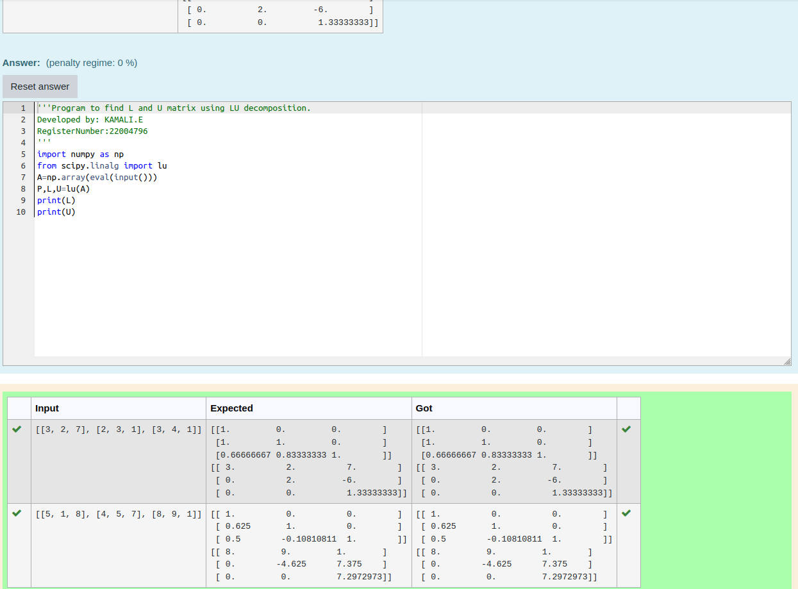

# LU Decomposition 

## AIM:
To write a program to find the LU Decomposition of a matrix.

## Equipments Required:
1. Hardware – PCs
2. Anaconda – Python 3.7 Installation / Moodle-Code Runner

## Algorithm
1. Algorithm

2.  Import numpy library using import statement

3. From scipy package import lu_factor() and lu_solve().

4. Get two inputs from user and pass it as matrix array.

5. Find lu and pivot value of first marix using lu_factor().

6. Find solution of the matrix by using lu_solve() by passing lu, pivot values as first argument and second matrix as second argument.

7. Print the solution. 

## Program:
(i) To find the L and U matrix
```

'''Program to find L and U matrix using LU decomposition.
Developed by: KAMALI.E
RegisterNumber:22004796
'''
import numpy as np
from scipy.linalg import lu
A=np.array(eval(input()))
P,L,U=lu(A)
print(L)
print'''Program to solve a matrix using LU decomposition.
Developed by: 
RegisterNumber: 
'''

# To print X matrix (solution to the equations)
import numpy as np
from scipy.linalg import lu_factor,lu_solve
A=np.array(eval(input()))
b=np.array(eval(input()))
lu,piv=lu_factor(A)
x=lu_solve((lu,piv),b)
print(x)

```
(ii) To find the LU Decomposition of a matrix
...


## Output:



## Result:
Thus the program to find the LU Decomposition of a matrix is written and verified using python programming.

